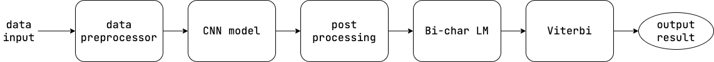

# Magic Glove
*Sign Language Recognition System on FPGA*

## Introduction

Magic glove is a glove which can do sign language recognition. We used some techniques used in speech recognition, and trained a cnn model. All of the computations are done in an FPGA board to implement hardware acceleration.

## Flow

#### Data input

We used an arduino nano, a 6-axis gyro, and potentiometers to collect the motion of hands.

#### Data preprocess

The data preprocessing is done to normalize input data.

#### CNN

We use a convolutional neural network (CNN) model to predict the character in the current frame.

#### Post processing

Since there will be some duplicates and noise throughout all frames, the post processing is done to deduplicate and denoise.

#### Bi-char LM

We build a bi-charactor dictionary to store the probability of occurrence for each two consecutive characters.

#### Viterbi

Through the probability of bi-character, we can calculate the cumulative probability of all possible words, the word with highest probability will be the result.

#### Output result

We show our result on a monitor through VGA.